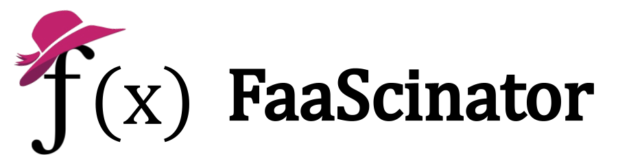

<p align="center"></p>

[](https://github.com/oleg-nenashev//faascinator/releases) 
[](code_of_conduct.md)

[](https://twitter.com/intent/follow?screen_name=oleg_nenashev) 

# FaaScinator - Java CLI Apps as serverless functions (preview)

Converts Java CLI apps into serverless [OpenFaaS](https://www.openfaas.com/) functions, 
powered by [Quarkus](https://quarkus.io/), [picocli](https://picocli.info/), [Docker](https://www.docker.com/) and [Adoptium JDK](https://adoptium.net/).
This project is under active development (and may not work).
Feedback is welcome!

## Quickstart

This demo requires Docker on your machine.
_Docker for Windows_ and _Docker for Mac_ will also do the job.   

To get started, clone this repository to your local computer and go into itsroot directory.
Then build the demo project:

```bash
mvn -f demo/currentTime/cli-app/ clean package
```

Run the following command:

```bash
docker run --rm -p 8080:8080 \
	-v $(pwd)/demo/currentTime/cli-app/target/demo-current-time.jar:/app/payload.jar \
 	-e QUARKUS_FAASCINATOR_DESCRIPTION="Shows the current time" \
	-e QUARKUS_FAASCINATOR_CLIJAR=/app/payload.jar \
	-e QUARKUS_FAASCINATOR_MAINCLASS="io.faascinator.demo.currenttime.CurrentTime" \
	ghcr.io/oleg-nenashev/faascinator:main
```

The command will start the image and expose the API server on port `8080`.
Then you can:

1. Get current time by opening http://localhost:8080
2. Get current time in Zurich timezone by opening http://localhost:8080/?arg=Europe/Zurich
3. Get help by opening http://localhost:8080/help

## Usage

### Running in CLI

FaaScinator can be launched as a standard Quarkus service.
It allows passing external CLI JAR and settings via
[Quarkus configuration sources](https://quarkus.io/guides/config-reference#configuration_sources).

The following command will start the service on port 8080:

```bash
java \
     -Dquarkus.faascinator.description="Shows the current time" \
     -Dquarkus.faascinator.mainClass="io.faascinator.demo.currenttime.CurrentTime" \
     -Dquarkus.faascinator.cliJar="demo/currentTime/cli-app/target/demo-current-time.jar" \
     -jar function/2_service/target/quarkus-app/quarkus-run.jar \
     Europe/Zurich
```

See the demo [here](./demo/currentTime).

### Running in Docker

The Docker image needs to be built first.
To launch the Docker Image with an arbitrary JAR, use the following command:

```
docker --rm -p 8080:8080 \
   -v $(pwd)/demo/currentTime/cli-app/target/demo-current-time.jar:/app/payload.jar \
   -e QUARKUS_FAASCINATOR_DESCRIPTION="Shows the current time" \
   -e QUARKUS_FAASCINATOR_CLIJAR=/app/payload.jar \
   -e QUARKUS_FAASCINATOR_MAINCLASS="io.faascinator.demo.currenttime.CurrentTime" \
   ghcr.io/oleg-nenashev/faascinator:main
```

### Running in OpenFaaS

Coming soon!

## Planned features

* Deeper integration with [Quarkus](https://quarkus.io/) via extensions.
* Serverless template for [OpenFaaS](https://www.openfaas.com/).
* Support for setting system properties and environment variables via requests.
* Conversion of [picocli](https://picocli.info/) to JSON schema for the invocation interface.
* Support for Java 17 and, unlikely, for Java 1.8.
* Future: support for [kohsuke/args4j](https://github.com/kohsuke/args4j) as a CLI provider.
* Future: support for packaging as a native executable with GraalVM.

## Design

This is how the FaaScinator design looks like.
And yes, it was initially drawn on a napkin during the lunch break!
[Proof in Twitter](https://twitter.com/oleg_nenashev/status/1408776830363082758).


## License

All code is licensed under the [Apache License Version 2.0](https://www.apache.org/licenses/LICENSE-2.0).
Graphics, presentation slides and other materials are licensed under
[Creative Commons Attribution-ShareAlike 3.0 Unported License](https://creativecommons.org/licenses/by-sa/3.0/).

## Code of Conduct

This project adopted [Contributor Covenant 2.0](https://www.contributor-covenant.org/) as Code of Conduct.
See the full version and escalation guidelines [here](./CODE_OF_CONDUCT.md).

## Contributing

Any contributions are welcome!
There are no contributor license agreement or other obstacles in this repository.
You can just submit a pull request or share your feedback!
More information: [Contributing Guide](./CONTRIBUTING.md).
